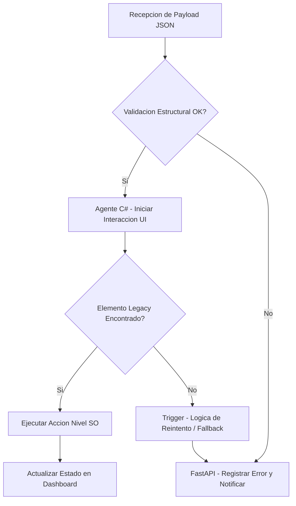

# ⚙️ RPA & Automation Architecture Concepts

Este repositorio es una **demostración conceptual** de los patrones de arquitectura, estructuras de datos y metodologías de integración que he utilizado para diseñar motores de automatización (RPA) escalables y resilientes.

> **Nota de confidencialidad:** El código fuente del motor en producción se mantiene en un repositorio privado sujeto a acuerdos de no divulgación (NDA). Este repositorio expone la teoría, los patrones arquitectónicos y fragmentos genéricos que ilustran mi enfoque técnico.

---

## Sobre el proyecto

El sistema permite la creación visual de flujos lógicos complejos mediante **Grafos Acíclicos Dirigidos (DAGs)**, los cuales se serializan en formato JSON para ser ejecutados de forma remota. A diferencia del RPA tradicional, utiliza un modelo distribuido donde un **cerebro central en la nube** coordina múltiples agentes locales capaces de interactuar con el sistema operativo a bajo nivel.

---

## Stack tecnológico

| Capa | Tecnología | Rol |
|------|-----------|-----|
| Orquestación y lógica | Python · FastAPI | Backend central, motor de DAGs, cola de trabajo |
| Control y visualización | Angular · TypeScript (Nx) | Dashboard, editor visual de flujos |
| Ejecución y bajo nivel | .NET / C# | Agente remoto, interacción con SO legacy |
| Transporte | WebSocket | Comunicación en tiempo real entre backend y agente |
| Definición de flujos | JSON | Serialización y transporte de los DAGs |

---

## Arquitectura general

<p align="center">
  
</p>


## 1. Orquestación mediante Grafos Acíclicos Dirigidos (DAGs)

Para evitar la fragilidad de los scripts de automatización lineales, estructuro la ejecución en nodos de decisión. Esto permite tolerancia a fallos, reintentos automáticos y ramificaciones lógicas complejas.

Esquema simplificado de cómo el orquestador procesa una tarea:



---

## 2. Ejecución local (el agente en C#)

Para interactuar con software legacy que carece de APIs modernas, el agente utiliza `.NET / C#` para comunicarse directamente con el sistema operativo. En lugar de depender de librerías de alto nivel propensas a romperse por cambios en la UI, interactúa con la **API nativa de Windows** (`user32.dll`) o **UI Automation**.

La conexión con el backend se mantiene a través de un **WebSocket persistente**, lo que permite recibir instrucciones en tiempo real y reportar el estado de cada nodo ejecutado.

**Snippet conceptual:** Inyección de eventos a nivel SO.

```csharp
using System;
using System.Runtime.InteropServices;

namespace RPA.Core.Native
{
    public class Win32Agent
    {
        // Importación de librerías nativas de Windows para control absoluto
        [DllImport("user32.dll")]
        static extern bool SetCursorPos(int X, int Y);

        [DllImport("user32.dll")]
        public static extern void mouse_event(int dwFlags, int dx, int dy, int cButtons, int dwExtraInfo);

        private const int MOUSEEVENTF_LEFTDOWN = 0x02;
        private const int MOUSEEVENTF_LEFTUP   = 0x04;

        /// <summary>
        /// Ejecuta un clic en coordenadas específicas de la pantalla
        /// saltando las capas de UI de alto nivel.
        /// </summary>
        public void ExecuteNativeClick(int x, int y)
        {
            SetCursorPos(x, y);
            mouse_event(MOUSEEVENTF_LEFTDOWN | MOUSEEVENTF_LEFTUP, x, y, 0, 0);
        }
    }
}
```

---

## 3. El cerebro backend (Python / FastAPI)

El agente local es "ciego" a la estrategia del negocio; simplemente ejecuta nodos. El verdadero orquestador es el backend en Python, que gestiona la cola de trabajo, define qué camino del DAG se debe tomar y expone los resultados al dashboard en tiempo real.

**Snippet conceptual:** Endpoint de orquestación asíncrona.

```python
from fastapi import FastAPI, HTTPException
from pydantic import BaseModel
from typing import Dict, Any

app = FastAPI(title="RPA Orchestrator Core")

class NodePayload(BaseModel):
    workflow_id: str
    node_action: str
    parameters: Dict[str, Any]

@app.post("/api/v1/agent/trigger")
async def trigger_dag_node(payload: NodePayload):
    """
    Recibe la orden de ejecución desde el Dashboard o un evento programado,
    evalúa la regla de negocio y despacha la tarea al agente remoto en C#.
    """
    try:
        # Lógica conceptual: Encolar tarea en Redis/RabbitMQ para el agente C#
        queue_status = await enqueue_to_agent(payload.workflow_id, payload.node_action)

        return {
            "status": "queued",
            "message": f"Acción '{payload.node_action}' encolada para ejecución.",
            "workflow": payload.workflow_id
        }
    except Exception as e:
        raise HTTPException(status_code=500, detail="Error orquestando el nodo.")
```

---

## Principios de diseño

- **Desacoplamiento total** — cada capa ignora los detalles de implementación de las demás.
- **Resiliencia por diseño** — los DAGs incluyen nodos de fallback y reintentos explícitos.
- **Bajo nivel cuando es necesario** — se evita depender de la UI cuando el SO ofrece una API más estable.
- **Observabilidad** — cada nodo reporta su estado al orquestador, que lo refleja en el dashboard en tiempo real.
